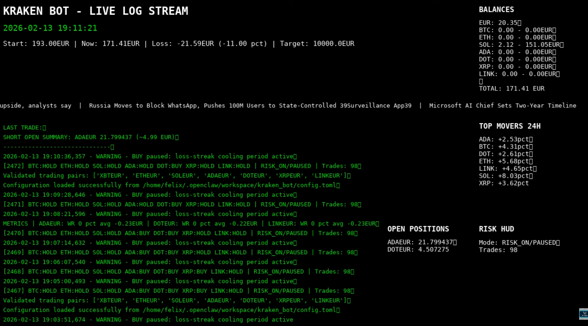

# 📺 Kraken Trading Bot — 24/7 YouTube Live Stream

> A Raspberry Pi-powered 24/7 livestream of a live Kraken crypto trading bot — no OBS, no GUI, just ffmpeg, bash, and Python.

[](https://www.youtube.com/@TheEfficientDev)
[](https://github.com/irgendwasmitfelix/TradingBot)
[](https://irgendwasmitfelix.github.io)

---



---

## 🎯 What is this?

This repo powers a **live YouTube stream** that shows a Kraken algorithmic trading bot running in real time on a Raspberry Pi. Every 2 minutes the stream pulls fresh data directly from the Kraken API and renders it as a 1280×720 video overlay — balance, positions, trades, top movers, and a scrolling crypto news ticker.

**Why this exists:** Transparency. The bot trades real money and everything is visible live.

🔴 **[Watch the live stream → youtube.com/@TheEfficientDev](https://www.youtube.com/@TheEfficientDev)**

🤖 **[See the trading bot that powers it → github.com/irgendwasmitfelix/TradingBot](https://github.com/irgendwasmitfelix/TradingBot)**

---

## 🖥️ Stream Layout

```
┌─────────────────────────────────────────────────────────────┐
│ KRAKEN BOT - LIVE LOG STREAM              BALANCES          │
│ 2026-04-04 09:00:00                       EUR  : 278.54 EUR │
│ Balance: 319.56 EUR                       ETH  : 0.02 (41€) │
│                                           TOTAL: 319.56 EUR │
│ LAST TRADES:                                                 │
│   sell 0.22 soleur                        TOP MOVERS 24H    │
│ ----------                                BTC   +2.41%      │
│ 09:00:01 ETH:HOLD SOL:HOLD ADA:HOLD...   ETH   -1.13%      │
│ 08:59:01 ...                              SOL   +4.20%      │
│                                                              │
│                                           OPEN POSITIONS     │
│                                           ETH: 41.02 EUR    │
│                                                              │
│ ── CoinDesk: Bitcoin hits new ATH ── Cointelegraph: ... ──  │
└─────────────────────────────────────────────────────────────┘
```

**Updates every 2 minutes.** Runs 24/7 on a Raspberry Pi.

---

## ⚙️ Architecture

| Component | Role |
|---|---|
| `stream.sh` | ffmpeg — renders text overlay onto black canvas, streams via RTMP to YouTube |
| `update_overlay.sh` | Main data loop — writes to `/tmp/youtube_stream/*.txt` every 2 min |
| `get_kraken_balance.py` | Live portfolio balances from Kraken API |
| `get_recent_trades.py` | Last 3 executed trades from Kraken API |
| `get_top_movers.py` | 24h price change for major pairs |
| `fetch_news.sh` | Hourly crypto news from RSS feeds (CoinDesk, Cointelegraph, etc.) |
| `youtube-stream.service` | systemd — auto-restarts stream on crash or reboot |
| `youtube-overlay.service` | systemd — runs overlay data loop continuously |
| `fetch-news.timer` | systemd timer — triggers news fetch every hour |

---

## 🚀 Setup

### 1. Clone
```bash
git clone https://github.com/irgendwasmitfelix/tedstream.git
cd tedstream
```

### 2. Configure
```bash
cp .env.example .env
# Fill in your Kraken API key and YouTube stream key
```

### 3. Python dependencies
```bash
python3 -m venv venv
venv/bin/pip install krakenex python-dotenv toml
```

### 4. Install services
```bash
sudo cp youtube-stream.service /etc/systemd/system/
sudo systemctl daemon-reload
sudo systemctl enable --now youtube-stream
sudo systemctl enable --now youtube-overlay
sudo systemctl enable --now fetch-news.timer
```

---

## 🛠️ Service Commands

```bash
sudo systemctl status youtube-stream      # Check stream
sudo systemctl restart youtube-overlay    # Restart data updater
sudo journalctl -u youtube-stream -f      # Live stream logs
sudo journalctl -u youtube-overlay -f     # Live overlay logs
```

---

## 🔒 Security

- `.env` is in `.gitignore` — never committed
- Use Kraken API keys with **read-only** permissions for display only
- Stream key = password — keep it private

---

## 🧱 Tech Stack

`ffmpeg` · `bash` · `Python 3` · `krakenex` · `systemd` · `Raspberry Pi`

---

## 👤 Author

**Felix** — [@irgendwasmitfelix](https://github.com/irgendwasmitfelix)

🌐 [irgendwasmitfelix.github.io](https://irgendwasmitfelix.github.io) · 📺 [youtube.com/@TheEfficientDev](https://www.youtube.com/@TheEfficientDev) · 🤖 [TradingBot Repo](https://github.com/irgendwasmitfelix/TradingBot)

---

> ⭐ If you find this useful or interesting, a star helps others discover it!
